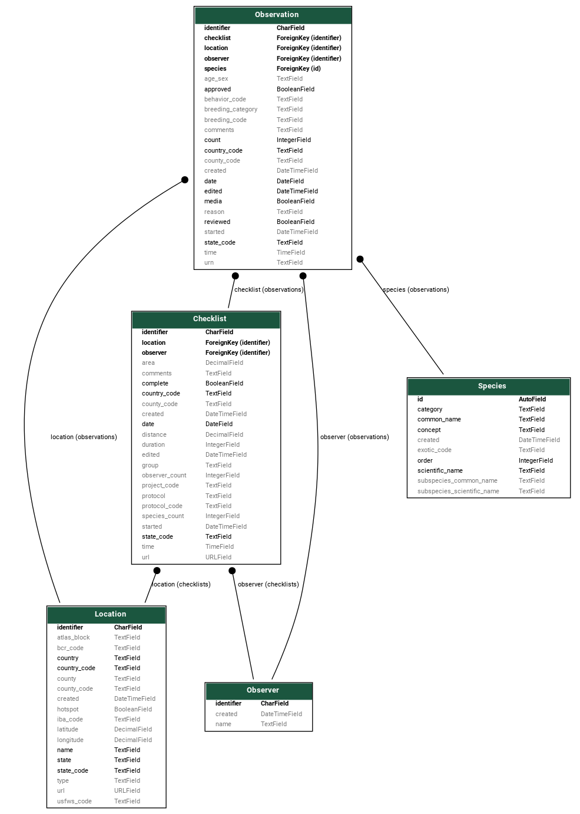

===============
Database Schema
===============
ebird-dataset-data loads the data into five Django models: Checklist, Location,
Observer, Observation and Species:

The lightning tour in 15 seconds:

* A Checklist has a Location.
* A Checklist has an Observer.
* A Checklist has a Location.
* A Checklist has a list of Observations.
* An Observation belongs to a Checklist.
* An Observation has a Species.
* An Observation has a Location.
* An Observation has an Observer.

Notes
-----
1. Location and Observer are duplicated on Observation to make queries easy.

2. The country, state and county codes from Location are duplicated on Checklist 
   and Observation to make queries easy.

3. The models use TextField as it works equally well with SQLite3 and PostgreSQL
   as CharField. This means there will not be a problem if the size of strings
   from eBird get longer.

4. The Observer is the person who submitted the checklist to eBird. If the checklist
   was shared or other people in the group also submitted a checklist then the `group`
   attribute on `Checklist` will contain an identifier which can be used to link
   them together.

